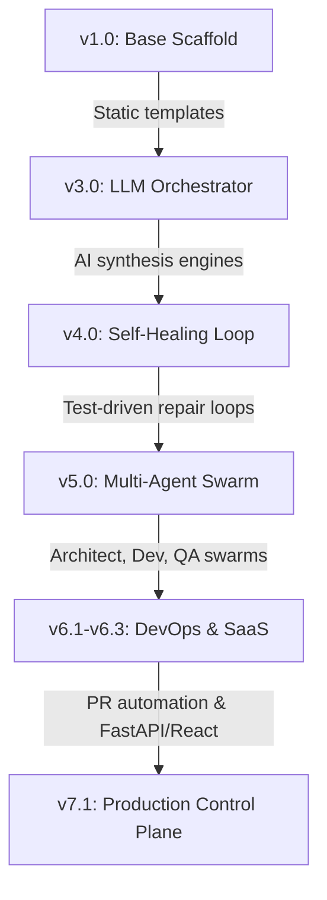

# Autonomous Dev Factory — Evolution & Core Engines 🤖🔧

[](https://fastapi.tiangolo.com)
[](https://react.dev)
[](https://openai.com)
[](https://github.com/features/actions)
[](https://opensource.org/licenses/MIT)

This repository serves as the evolutionary archive and development history of the **God-Tier Autonomous Software Engineering Factory**. It contains the progressive iterations, blueprints, and core AI synthesis engines from **v1.0 to v7.1**.

---

## 🗺️ The Evolutionary Roadmap



### 🗃️ Iterative Milestones & Engines

*   **[scaffold.py](scaffold.py) (v1.0)**: Initial local folder structure and boilerplate generators for 10 distinct developer-focused repositories.
*   **[generate_all_repos.ps1](generate_all_repos.ps1) & [push_to_github.py](push_to_github.py) (v2.0)**: Full DevOps factory automation script to initialize local git repositories and automate remote pushes, release tagging, and metadata topics.
*   **[scaffold_v3_real.py](scaffold_v3_real.py) (v3.0)**: Wired up the core AI generation engine featuring modular generators and LLM prompt clients.
*   **[scaffold_v4.py](scaffold_v4.py) (v4.0)**: Built the **Self-Healing Loop** capable of executing static analysis, running test suites, and executing automated code repairs.
*   **[scaffold_v5.py](scaffold_v5.py) (v5.0)**: Multi-agent coordination matrix designating roles for an *Architect*, *Developer*, *QA Analyst*, and *Reviewer*.
*   **[scaffold_v6_1.py](scaffold_v6_1.py) (v6.1)**: GitHub PR Automation layer creating branches and pull requests automatically.
*   **[scaffold_v6_2.py](scaffold_v6_2.py) (v6.2)**: Memory & Failure Database to track compile-time errors and auto-optimize LLM prompts based on historic bugs.
*   **[scaffold_v6_3.py](scaffold_v6_3.py) (v6.3)**: Interactive SaaS Dashboard consisting of a FastAPI server and a React visualization platform.
*   **[scaffold_v6_4.py](scaffold_v6_4.py) (v6.4)**: Autonomous continuous polling Swarm Daemon implementing automatic PR merges and self-healing.
*   **[scaffold_v7.py](scaffold_v7.py) & [main.py](main.py) (v7.1)**: Production-grade cloud deployment controllers (Vercel/Railway), dynamic LLM Cost-aware Router, Spec Validator, and live SSE streaming logs.

---

## ⚡ Setup & Launching the Engines

To inspect the evolutionary source code and run the latest modular scaffolds:
1. Clone the repository:
   ```bash
   git clone https://github.com/Raphasha27/autonomous-dev-factory-core.git
   ```
2. Run any historical or production engine:
   ```bash
   # Run the Multi-Agent Swarm Generator (v5.0)
   python scaffold_v5.py
   
   # Run the production API entrypoint
   python main.py
   ```

---

## 🤝 Contributing & Swarming

If you want to collaborate on building next-generation agentic workflows, feel free to contribute to this archive!

1. Fork the project.
2. Commit your evolutionary enhancements.
3. Open a Pull Request detailing the model architectures added.

---

## ❤️ Sponsors & Backers

Help us build the absolute future of zero-touch automated engineering swarms! Sponsors receive early access to experimental agents and priority feature requests.

- **GitHub Sponsors**: [Become a Sponsor](https://github.com/sponsors/Raphasha27)
- **OpenCollective**: [Support the Swarm](https://opencollective.com/devfactory-swarm)

*Developed with ❤️ by the DevFactory team.*
